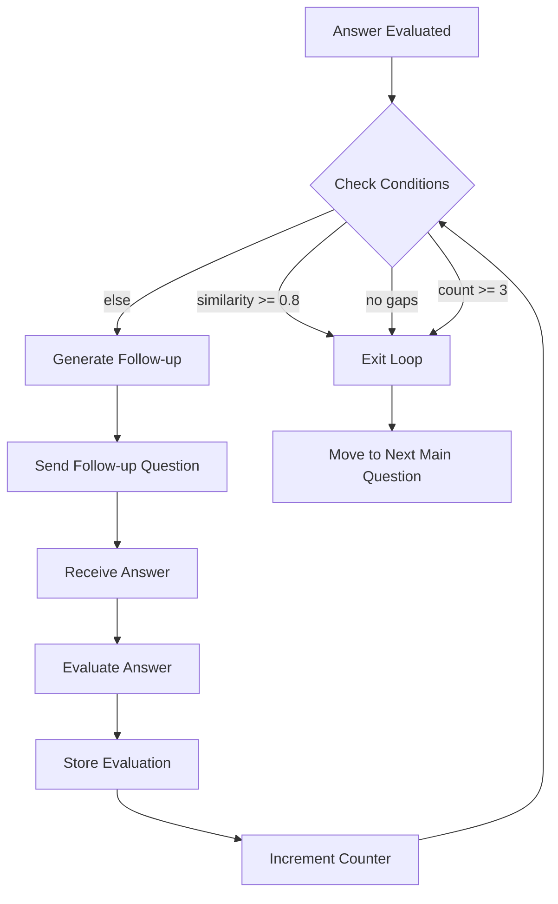

# Phase 4: Adaptive Follow-up Engine

**Duration**: 4 days
**Priority**: Critical
**Dependencies**: Phase 3 (Enhanced Evaluation)

## Context

Current `ProcessAnswerAdaptiveUseCase` generates at most 1 follow-up per main question. Need iterative loop that generates 0-3 follow-ups based on gap analysis. WebSocket handler must orchestrate follow-up cycle until gaps filled or max reached.

**Context Links**:
- `src/application/use_cases/process_answer_adaptive.py` - Current adaptive evaluation (418 lines)
- `src/adapters/api/websocket/interview_handler.py` - WebSocket handler (435 lines)
- `src/domain/models/follow_up_question.py` - Follow-up question model (44 lines)
- `src/domain/models/answer.py` - Answer model with gaps and similarity_score (146 lines)

## Key Insights

1. **Iterative Loop**: Follow-ups must be generated in sequence (can't parallelize) → Each answer informs next follow-up
2. **Gap Tracking**: Gaps from previous follow-up must be carried forward → Accumulate missing concepts
3. **Break Conditions**: 3 conditions trigger loop exit → similarity >=80% OR no gaps OR max 3 reached
4. **Session State**: Must track follow-up count per main question → Stored in Interview.adaptive_follow_ups
5. **Decision Logic**: LLM decides if follow-up needed → Separate use case for modularity

## Requirements

### Functional Requirements

**FR1**: Iterative follow-up generation
- After each answer evaluation, check break conditions
- If needed, generate follow-up question (LLM)
- Repeat up to 3 times per main question
- Track cumulative gaps across follow-up cycle

**FR2**: Break condition logic
- Condition 1: similarity_score >= 0.8 (answer quality meets threshold)
- Condition 2: gaps.confirmed == False (no confirmed gaps detected)
- Condition 3: follow_up_count >= 3 (max follow-ups reached)
- Exit loop if ANY condition met

**FR3**: Gap-based question generation
- LLM generates follow-up targeting specific missing concepts
- Context: parent question + all previous answers + detected gaps
- Severity weighting: Critical gaps prioritized over minor ones
- Order tracking: 1st, 2nd, 3rd follow-up clearly marked

**FR4**: Session state management
- Track follow-up count per main question (not global)
- Store follow-up IDs in Interview.adaptive_follow_ups array
- Persist state after each follow-up generation
- Reset counter when moving to next main question

### Non-Functional Requirements

**NFR1**: Performance
- Follow-up generation latency: <2s per question
- Total loop latency: <6s for max 3 follow-ups
- No blocking operations during loop

**NFR2**: Consistency
- Ensure follow-up questions don't repeat
- Track all evaluations for final summary
- Maintain parent question relationship

**NFR3**: Error Handling
- Timeout per follow-up iteration: 30s
- Hard limit: Exit loop after 3 iterations regardless of state
- Graceful degradation: Skip follow-up if LLM fails

## Architecture

### Follow-up Decision Logic



### New Use Case: FollowUpDecisionUseCase

```python
# src/application/use_cases/follow_up_decision.py
class FollowUpDecisionUseCase:
    """Decide if follow-up question should be generated."""

    def __init__(
        self,
        answer_repository: AnswerRepositoryPort,
        follow_up_question_repository: FollowUpQuestionRepositoryPort,
    ):
        self.answer_repo = answer_repository
        self.follow_up_repo = follow_up_question_repository

    async def execute(
        self,
        interview_id: UUID,
        parent_question_id: UUID,
        latest_answer: Answer,
    ) -> dict[str, Any]:
        """Decide if follow-up needed and return decision details.

        Returns:
            {
                "needs_followup": bool,
                "reason": str,  # Why follow-up needed/not needed
                "follow_up_count": int,
                "cumulative_gaps": list[str],  # All gaps across follow-ups
            }
        """
        # Count existing follow-ups
        follow_ups = await self.follow_up_repo.get_by_parent_question_id(
            parent_question_id
        )
        follow_up_count = len(follow_ups)

        # Check break conditions
        if follow_up_count >= 3:
            return {
                "needs_followup": False,
                "reason": "Max follow-ups (3) reached",
                "follow_up_count": follow_up_count,
                "cumulative_gaps": [],
            }

        if latest_answer.is_adaptive_complete():
            return {
                "needs_followup": False,
                "reason": "Answer meets completion criteria (similarity >= 0.8 or no gaps)",
                "follow_up_count": follow_up_count,
                "cumulative_gaps": [],
            }

        # Accumulate gaps from previous follow-ups
        cumulative_gaps = await self._accumulate_gaps(follow_ups, latest_answer)

        return {
            "needs_followup": True,
            "reason": f"Detected {len(cumulative_gaps)} missing concepts",
            "follow_up_count": follow_up_count,
            "cumulative_gaps": cumulative_gaps,
        }

    async def _accumulate_gaps(
        self,
        follow_ups: list[FollowUpQuestion],
        latest_answer: Answer,
    ) -> list[str]:
        """Accumulate gaps from all follow-up answers."""
        all_gaps = set()

        # Get gaps from latest answer
        if latest_answer.gaps and latest_answer.gaps.get("confirmed"):
            concepts = latest_answer.gaps.get("concepts", [])
            all_gaps.update(concepts)

        # Get gaps from previous follow-up answers
        for follow_up in follow_ups:
            # Fetch answer for this follow-up
            answer = await self.answer_repo.get_by_question_id(follow_up.id)
            if answer and answer.gaps and answer.gaps.get("confirmed"):
                concepts = answer.gaps.get("concepts", [])
                all_gaps.update(concepts)

        return list(all_gaps)
```

### Enhanced WebSocket Handler

```python
# Enhanced handle_text_answer() in interview_handler.py
async def handle_text_answer(interview_id: UUID, data: dict, container):
    """Handle text answer with iterative follow-up loop."""
    async for session in get_async_session():
        interview_repo = container.interview_repository_port(session)
        question_repo = container.question_repository_port(session)
        answer_repo = container.answer_repository_port(session)
        follow_up_repo = container.follow_up_question_repository()

        interview = await _validate_interview_exists(interview_id, interview_repo)
        if not interview:
            break

        # Process answer with evaluation
        answer, _, has_more = await _process_answer(
            interview_id=interview_id,
            question_id=UUID(data["question_id"]),
            answer_text=data["answer_text"],
            answer_repo=answer_repo,
            interview_repo=interview_repo,
            question_repo=question_repo,
            container=container,
        )

        # Send evaluation
        await _send_evaluation(interview_id, answer)

        # Follow-up loop (max 3 iterations)
        parent_question_id = UUID(data["question_id"])
        tts = container.text_to_speech_port()

        follow_up_iteration = 0
        MAX_FOLLOWUPS = 3

        while follow_up_iteration < MAX_FOLLOWUPS:
            # Decision: Do we need a follow-up?
            decision_use_case = FollowUpDecisionUseCase(
                answer_repository=answer_repo,
                follow_up_question_repository=follow_up_repo,
            )
            decision = await decision_use_case.execute(
                interview_id=interview_id,
                parent_question_id=parent_question_id,
                latest_answer=answer,
            )

            if not decision["needs_followup"]:
                logger.info(f"Follow-up loop exit: {decision['reason']}")
                break

            # Generate follow-up question
            follow_up_question = await _generate_and_store_followup(
                interview_id=interview_id,
                parent_question_id=parent_question_id,
                latest_answer=answer,
                cumulative_gaps=decision["cumulative_gaps"],
                order=decision["follow_up_count"] + 1,
                container=container,
            )

            # Send follow-up question with audio
            await _send_follow_up_question(interview_id, follow_up_question, tts)

            # Wait for answer (blocking until next message)
            # NOTE: This requires refactoring to handle nested message loop
            # For now, exit loop and wait for next message
            break

        # Send next main question or complete
        if has_more:
            await _send_next_question(
                interview_id, interview, interview_repo, question_repo, tts
            )
        else:
            await _complete_interview(interview_id, interview_repo, answer_repo)

        break
```

## Implementation Steps

### Day 1: Follow-up Decision Logic

**Step 1**: Create FollowUpDecisionUseCase
- Implement break condition checks
- Implement gap accumulation logic
- Add follow-up counting per parent question

**Step 2**: Update FollowUpQuestionRepository
- Add get_by_parent_question_id() method
- Add get_by_interview_id() method
- Test with mock data

**Step 3**: Unit tests for decision logic
- Test max follow-ups reached
- Test similarity threshold
- Test no gaps detected

### Day 2: Follow-up Generation Enhancement

**Step 1**: Enhance LLMPort.generate_followup_question()
- Add cumulative_gaps parameter
- Add order parameter (1st, 2nd, 3rd)
- Add severity weighting

**Step 2**: Update OpenAIAdapter.generate_followup_question()
- Enhance prompt with cumulative gaps
- Add context from previous follow-ups
- Test with real OpenAI API

**Step 3**: Update ProcessAnswerAdaptiveUseCase
- Remove single follow-up generation
- Delegate to FollowUpDecisionUseCase
- Simplify to focus on evaluation only

### Day 3: WebSocket Handler Refactoring

**Step 1**: Implement follow-up loop in handle_text_answer()
- Add while loop with max 3 iterations
- Call FollowUpDecisionUseCase
- Handle nested message reception

**Step 2**: Add session state tracking
- Track current parent question ID
- Track follow-up iteration count
- Persist state in memory (future: Redis)

**Step 3**: Add error handling
- Timeout per iteration (30s)
- Hard limit enforcement
- Graceful degradation on LLM failure

### Day 4: Testing & Validation

**Step 1**: Integration tests
- Test full follow-up loop (0-3 iterations)
- Test break conditions
- Test gap accumulation

**Step 2**: E2E tests
- Test real interview session with follow-ups
- Verify evaluation history
- Check final summary includes follow-ups

**Step 3**: Performance testing
- Measure loop latency
- Test concurrent interviews with follow-ups
- Optimize if >6s total loop time

## Todo List

**Day 1**:
- [ ] Create FollowUpDecisionUseCase in application/use_cases/
- [ ] Implement break condition logic (3 conditions)
- [ ] Implement gap accumulation from previous follow-ups
- [ ] Add get_by_parent_question_id() to FollowUpQuestionRepositoryPort
- [ ] Implement in PostgreSQLFollowUpQuestionRepository
- [ ] Write unit tests for decision logic

**Day 2**:
- [ ] Enhance LLMPort.generate_followup_question() signature
- [ ] Update OpenAIAdapter with cumulative gaps context
- [ ] Update MockLLMAdapter for testing
- [ ] Simplify ProcessAnswerAdaptiveUseCase (remove single follow-up)
- [ ] Write unit tests for enhanced follow-up generation

**Day 3**:
- [ ] Refactor handle_text_answer() with while loop
- [ ] Implement session state tracking (follow-up count)
- [ ] Add timeout and hard limit enforcement
- [ ] Update _send_follow_up_question() helper
- [ ] Add logging for follow-up loop events

**Day 4**:
- [ ] Write integration tests for follow-up loop
- [ ] Write E2E test for full interview with follow-ups
- [ ] Measure and optimize loop latency
- [ ] Update docs with follow-up loop architecture
- [ ] Code review and refactoring

## Success Criteria

- ✅ Follow-up loop generates 0-3 questions based on gaps
- ✅ Break conditions correctly exit loop (similarity, gaps, max count)
- ✅ Gap accumulation works across follow-up iterations
- ✅ Session state tracks follow-up count per main question
- ✅ Total loop latency <6s for max 3 follow-ups
- ✅ Integration tests cover all break condition paths
- ✅ E2E test verifies full interview with follow-ups

## Risk Assessment

| Risk | Impact | Probability | Mitigation |
|------|--------|-------------|------------|
| Infinite loop bug | Critical | Low | Hard limit max 3, timeout 30s per iteration |
| Nested message handling complexity | High | Medium | Simplify to exit loop and wait for next message |
| Gap accumulation errors | Medium | Medium | Extensive unit tests, validate with real data |
| Performance degradation | Medium | Low | Optimize LLM prompts, measure latency per iteration |

## Security Considerations

1. **Rate Limiting**: Enforce max 3 follow-ups per question (prevent abuse)
2. **Timeout**: 30s per iteration prevents DoS
3. **State Validation**: Verify follow-up count before generation
4. **Logging**: Log all follow-up generation for audit trail
