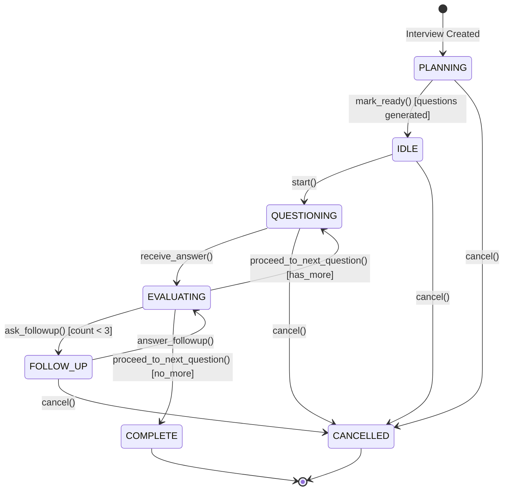

# Phase 5: Documentation & Cleanup

## Context Links
- **Parent Plan**: [plan.md](./plan.md)
- **Dependencies**: Phase 4 (Test Suite Updates)
- **Related Docs**:
  - `docs/system-architecture.md`
  - `docs/codebase-summary.md`

## Overview

**Date**: 2025-11-12
**Description**: Update documentation and clean up obsolete code
**Priority**: MEDIUM (polish and knowledge transfer)
**Effort Estimate**: 1 hour
**Implementation Status**: ⏳ Not Started
**Review Status**: ⏳ Pending

## Key Insights

1. **Architecture Docs**: Reflect single source of truth pattern
2. **State Diagram**: Visual representation helps future developers
3. **Code Comments**: Remove outdated SessionState references
4. **Developer Guide**: Document new state management approach

## Requirements

### Functional Requirements
- ✅ Update system architecture documentation
- ✅ Update codebase summary with new patterns
- ✅ Add state machine diagram
- ✅ Remove obsolete comments referencing SessionState
- ✅ Document domain state transition rules
- ✅ Update README if orchestrator usage changed

### Non-Functional Requirements
- ✅ Clear, concise documentation
- ✅ Visual diagrams for complex concepts
- ✅ Examples showing correct usage
- ✅ Developer-friendly explanations

## Architecture

### State Machine Diagram
Add to `docs/system-architecture.md`:



## Related Code Files

### To Modify
- `docs/system-architecture.md` (state management section)
- `docs/codebase-summary.md` (orchestrator description)
- `README.md` (if needed)
- `src/adapters/api/websocket/session_orchestrator.py` (docstrings)
- `src/domain/models/interview.py` (class docstring)

## Implementation Steps

### Step 1: Update System Architecture Doc
**File**: `docs/system-architecture.md`

**Add Section**: State Management Pattern

```markdown
## State Management

### Single Source of Truth Pattern

The Interview domain model is the **single source of truth** for interview state. The WebSocket orchestrator is stateless and loads state from the database before each operation.

**Architecture Decision**: Domain-driven state management
- Domain model (`Interview`) owns all state and transition logic
- Orchestrator coordinates operations but doesn't track state
- State persists in PostgreSQL via repository
- REST and WebSocket see consistent state

### State Transition Rules

Interview status follows strict transition rules enforced by domain:

[Insert Mermaid diagram here]

**Valid Transitions**:
- PLANNING → IDLE (questions generated, ready to start)
- PLANNING → CANCELLED (cancel during planning)
- IDLE → QUESTIONING (start interview)
- IDLE → CANCELLED (cancel before start)
- QUESTIONING → EVALUATING (receive answer)
- EVALUATING → FOLLOW_UP (need clarification, max 3x)
- EVALUATING → QUESTIONING (next question)
- EVALUATING → COMPLETE (no more questions)
- FOLLOW_UP → EVALUATING (follow-up answered)

**Terminal States**: COMPLETE, CANCELLED (no further transitions)

### Follow-Up Tracking

Domain tracks follow-up questions per parent question:
- `current_parent_question_id`: Current main question being explored
- `current_followup_count`: Number of follow-ups asked (0-3)
- Counter resets when advancing to next main question
- Max 3 follow-ups per main question enforced by domain

### Performance Considerations

**Query Frequency**: ~2 queries/minute over 20-30 min interview
**Overhead**: Negligible for long-running sessions
**Benefit**: State consistency across all interfaces
```

### Step 2: Update Codebase Summary
**File**: `docs/codebase-summary.md`

**Update Orchestrator Description**:

```markdown
### WebSocket Orchestrator

**Location**: `src/adapters/api/websocket/session_orchestrator.py`

**Responsibility**: Stateless coordinator for WebSocket interview sessions

**Design Pattern**: Thin coordination layer - domain owns logic

**Key Characteristics**:
- Loads `Interview` entity from DB before each operation
- Delegates all state transitions to domain methods
- Coordinates message flow (questions, evaluations, follow-ups)
- No in-memory state (except connection metadata)

**Usage**:
```python
orchestrator = InterviewSessionOrchestrator(interview_id, websocket, container)
await orchestrator.start_session()  # Sends first question
await orchestrator.handle_answer(answer_text)  # Process answer
```

**State Management**:
- Does NOT track state locally
- Loads `interview.status` from DB
- Uses domain methods: `interview.start()`, `interview.ask_followup()`, etc.
```

### Step 3: Add State Transition Documentation
**File**: `src/domain/models/interview.py`

**Update Class Docstring**:

```python
class Interview(BaseModel):
    """Interview aggregate root with state machine pattern.

    Represents an interview session with strict state transition rules.
    This is the single source of truth for interview state.

    State Lifecycle:
        PLANNING → IDLE → QUESTIONING → EVALUATING → [FOLLOW_UP] → QUESTIONING → ... → COMPLETE

    Valid Transitions:
        - PLANNING → IDLE (via mark_ready() after question generation)
        - IDLE → QUESTIONING (via start())
        - QUESTIONING → EVALUATING (via add_answer())
        - EVALUATING → FOLLOW_UP (via ask_followup(), max 3x per question)
        - EVALUATING → QUESTIONING (via proceed_to_next_question())
        - EVALUATING → COMPLETE (via proceed_to_next_question() when done)
        - FOLLOW_UP → EVALUATING (via answer_followup())
        - PLANNING, IDLE, QUESTIONING, EVALUATING, FOLLOW_UP → CANCELLED (via cancel())

    Follow-Up Tracking:
        - current_parent_question_id: Tracks which main question follow-ups relate to
        - current_followup_count: Number of follow-ups asked (0-3)
        - Counters reset when proceeding to next main question

    Thread Safety:
        This model is NOT thread-safe. Concurrent access requires repository-level locking.

    Example:
        >>> interview = Interview(candidate_id=candidate_id)
        >>> interview.status
        InterviewStatus.IDLE
        >>> interview.start()
        >>> interview.status
        InterviewStatus.QUESTIONING
        >>> interview.ask_followup(followup_id, parent_question_id)
        >>> interview.status
        InterviewStatus.FOLLOW_UP
    """
```

### Step 4: Clean Up Obsolete Comments
**Files**: All modified files in previous phases

Search and remove:
- References to `SessionState` enum
- Comments mentioning "in-memory state"
- Outdated state management explanations
- "TODO" comments related to state sync

**Search Pattern**:
```bash
cd H:\AI-course\EliosAIService
grep -r "SessionState" src/
grep -r "in-memory state" src/
grep -r "state sync" src/
```

### Step 5: Update Method Docstrings
**File**: `src/adapters/api/websocket/session_orchestrator.py`

Update method docstrings to reflect stateless nature:

```python
async def start_session(self) -> None:
    """Start interview session by loading domain state and sending first question.

    Loads interview from database, validates IDLE state, transitions to QUESTIONING
    via domain method, and sends first question to client.

    Raises:
        ValueError: If interview not found or not in IDLE state
    """

async def handle_answer(self, answer_text: str) -> None:
    """Handle answer by loading domain state and routing to appropriate handler.

    Loads interview status from database and routes to:
    - _handle_main_question_answer() if QUESTIONING
    - _handle_followup_answer() if FOLLOW_UP

    Args:
        answer_text: Candidate's answer text

    Raises:
        ValueError: If interview in invalid state for answering
    """
```

### Step 6: Add Developer Guide Section
**File**: `docs/development-guide.md` (create if doesn't exist)

```markdown
## State Management Guide

### Working with Interview State

Always load fresh state from database before operations:

```python
# ✅ Correct: Load from DB
interview = await interview_repo.get_by_id(interview_id)
if interview.status == InterviewStatus.QUESTIONING:
    # Handle question state

# ❌ Incorrect: Don't track state locally
self.state = "questioning"  # NO!
```

### Transitioning State

Use domain methods for all transitions:

```python
# ✅ Correct: Use domain methods
interview.start()  # IDLE → QUESTIONING
interview.ask_followup(followup_id, parent_id)  # EVALUATING → FOLLOW_UP
interview.proceed_to_next_question()  # EVALUATING → QUESTIONING/COMPLETE

# ❌ Incorrect: Don't modify status directly
interview.status = InterviewStatus.QUESTIONING  # NO!
```

### Follow-Up Management

Domain enforces max 3 follow-ups per question:

```python
# Check if more follow-ups allowed
if interview.can_ask_more_followups():
    interview.ask_followup(followup_id, parent_question_id)

# Counter resets automatically on next question
interview.proceed_to_next_question()
assert interview.current_followup_count == 0
```

### Testing State Transitions

Test domain logic separately from orchestrator:

```python
def test_state_transition():
    interview = Interview(candidate_id=uuid4())
    interview.start()
    assert interview.status == InterviewStatus.QUESTIONING
```
```

## Todo List

- [ ] Add state machine diagram to `docs/system-architecture.md`
- [ ] Update state management section in architecture docs
- [ ] Update orchestrator description in codebase summary
- [ ] Update `Interview` class docstring with state lifecycle
- [ ] Search and remove obsolete `SessionState` comments
- [ ] Update orchestrator method docstrings
- [ ] Create or update developer guide with state management patterns
- [ ] Review all documentation for accuracy
- [ ] Spell-check and formatting cleanup

## Success Criteria

✅ **Documentation Completeness**
- State machine diagram added
- Architecture patterns documented
- Developer guide includes examples
- All docstrings accurate

✅ **Code Cleanliness**
- No `SessionState` references in comments
- No outdated TODOs
- Consistent terminology

✅ **Developer Experience**
- Clear guidance on state management
- Examples show correct patterns
- Common mistakes highlighted

## Risk Assessment

| Risk | Impact | Probability | Mitigation |
|------|--------|-------------|------------|
| Documentation becomes stale | MEDIUM | MEDIUM | Add to code review checklist |
| Diagram complexity | LOW | LOW | Keep diagram simple, add legend |
| Missed obsolete comments | LOW | MEDIUM | Use grep to search thoroughly |

## Security Considerations

- **No Secrets in Docs**: Ensure no API keys or credentials in documentation
- **Public Visibility**: Docs may be public, avoid internal details
- **Example Data**: Use fake UUIDs and sanitized examples

## Next Steps

After completion:
1. **Peer Review**: Have another developer review documentation
2. **Team Walkthrough**: Present changes to team
3. **Knowledge Transfer**: Ensure all developers understand new pattern
4. **Deployment**: Ready for production deployment
5. **Monitor**: Watch for state-related issues post-deployment
